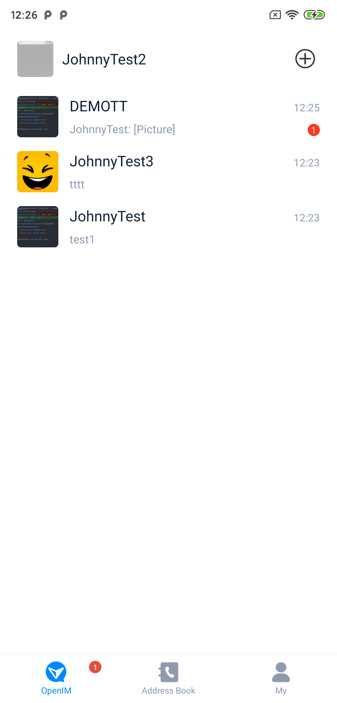
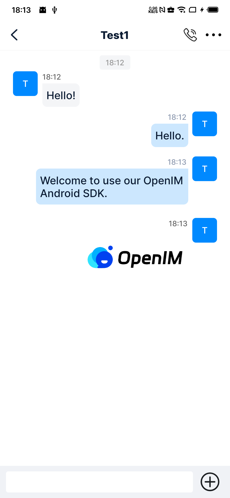

<p align="center">
    <a href="https://openim.io">
        
    </a>
</p>

# OpenIM Android 💬💻

<p>
  <a href="https://docs.openim.io/">OpenIM Docs</a>
  •
  <a href="https://github.com/openimsdk/open-im-server">OpenIM Server</a>
  •
  <a href="https://github.com/openimsdk/open-im-sdk-android">openim-sdk-android</a>
  •
  <a href="https://github.com/openimsdk/openim-sdk-core">openim-sdk-core</a>
</p>

OpenIM provides an open-source Instant Messaging (IM) SDK for developers, serving as an alternative solution to cloud services like Twilio and Sendbird. With OpenIM, developers can build secure and reliable IM applications similar to WeChat.

This repository is based on the open source version of OpenIM SDK. You can use this Demo as a reference implementation of OpenIM SDK. `@openim/android-client-sdk` and `@openim/core-sdk` are referenced to create native Android applications.

<p align="center">
   
   <span style="display: inline-block; width: 16px;"></span>
   
</p>
## License  📄:

This repository adopts the GNU Affero General Public License v3 (AGPL-3.0) with additional terms. **Commercial use is not permitted.** For more details, please refer to [here](./LICENSE).

## Development Environment

Before you start developing, please ensure that your system has the following software installed:

- **Operating System**:  Windows 11 22H2
- **Android Studio**: Android Studio Koala | 2024.1.1
- **Gradle**: 7.5.1
- **AGP**: 7.4.2
- **Java Runtime**: 17.0.10

You also need to have the latest version of the [OpenIM Server deployed](https://docs.openim.io/guides/gettingStarted/dockerCompose). After that, you can compile this project and connect it to your own server for testing.

## Runtime Environment

This application supports the following browsers and operating system versions:

| OS          | Version              | Status |
| ----------- | -------------------- | ------ |
| **Android** | 7.0-14.0             | ✅     |

### Note

- **Gradle&AGP**: We recommend that you keep the version consistent with the version in the above instructions. If you need to upgrade, you need to adapt it yourself. 

## Quick Start

Follow these steps to set up your local development environment:

1. Clone the repository

   ```bash
   git clone https://github.com/openimsdk/open-im-android-demo.git
   cd open-im-android-demo
   ```

2. Open and Sync the dependencies
   - Use Android Studio to open the Demo folder in the project root directory as the App directory of the Android project 
   
      > Please note that you should open the Demo folder instead of directly opening the project root directory. We recommend that you first read the [official doc](https://developer.android.com/studio/projects) to understand the composition of the Android project and the functions of different files in the project. 

3. Modify the configuration

   - In the `Constants.java` file:

     > After deployed [OpenIM Server](https://docs.openim.io/guides/gettingStarted/dockerCompose), you need to modified [this file](./OUIKit/OUICore/src/main/java/io/openim/android/ouicore/utils/Constants.java) to ensure it works properly.

     ```java
     public static final String DEFAULT_HOST = "your-server-ip or your-domain"
     ```

4. If you changed server's port, you need to modify the following code. If not, keep it for default.
   ```java
   private static final String APP_AUTH = "http://" + DEFAULT_HOST + ":10008/";
   private static final String IM_API = "http://" + DEFAULT_HOST + ":10002";
   private static final String IM_WS = "ws://" + DEFAULT_HOST + ":10001";
   ```

5. Start developing and testing! 🎉

## Audio/Video Calls

The open-source version supports one-to-one audio and video calls. You need to first deploy and configure the [server](https://github.com/openimsdk/chat/blob/main/HOW_TO_SETUP_LIVEKIT_SERVER.md). For multi-party audio/video calls or video conferencing, please contact us at [contact@openim.io](mailto:contact@openim.io).

## Build 🚀

> This project allows separate builds for the native android application.

1. Run assemble to build a test apk

```bash
gradlew assemble
```

1. The apk will be located in the `build/output` directory.

## Features

### Description

| Feature Module             | Feature                                                                          | Status |
| -------------------------- | -------------------------------------------------------------------------------- | ------ |
| **Account Features**       | Phone number registration \ Email registration \ Verification code login         | ✅     |
|                            | View \ Edit personal information                                                 | ✅     |
|                            | Multi-language settings                                                          | ✅     |
|                            | Change password \ Forgot password                                                | ✅     |
| **Friend Features**        | Find \ Apply \ Search \ Add \ Delete friends                                     | ✅     |
|                            | Accept \ Reject friend requests                                                  | ✅     |
|                            | Friend notes                                                                     | ✅     |
|                            | Allow friend requests or not                                                     | ✅     |
|                            | Friend list \ Friend data real-time syncing                                      | ✅     |
| **Blocklist**              | Restrict messages                                                                | ✅     |
|                            | Real-time syncing of blocklist                                                   | ✅     |
|                            | Add \ Remove from blocklist                                                      | ✅     |
| **Group Features**         | Create \ Dismiss groups                                                          | ✅     |
|                            | Apply to join \ Invite to join \ Leave group \ Remove members                    | ✅     |
|                            | Group name / Avatar changes / Group data updates (notifications, real-time sync) | ✅     |
|                            | Invite members to group                                                          | ✅     |
|                            | Transfer group ownership                                                         | ✅     |
|                            | Group owner or admin approve join requests                                       | ✅     |
|                            | Search group members                                                             | ✅     |
| **Message Features**       | Offline messages                                                                 | ✅     |
|                            | Roaming messages                                                                 | ✅     |
|                            | Multi-end messages                                                               | ✅     |
|                            | Message history                                                                  | ✅     |
|                            | Message deletion                                                                 | ✅     |
|                            | Clear messages                                                                   | ✅     |
|                            | Copy messages                                                                    | ✅     |
|                            | Typing indicator in single chat                                                  | ✅     |
|                            | Do Not Disturb for new messages                                                  | ✅     |
|                            | Clear chat history                                                               | ✅     |
|                            | New members can view group chat history                                          | ✅     |
|                            | New message reminders                                                            | ✅     |
|                            | Text messages                                                                    | ✅     |
|                            | Image messages                                                                   | ✅     |
|                            | Video messages                                                                   | ✅     |
|                            | Emoji messages                                                                   | ✅     |
|                            | File messages                                                                    | ✅     |
|                            | Voice messages                                                                   | ✅     |
|                            | Contact card messages                                                            | ✅     |
|                            | Location messages                                                                | ✅     |
|                            | Custom messages                                                                  | ✅     |
| **Conversation**           | Pin conversation                                                                 | ✅     |
|                            | Mark conversation as read                                                        | ✅     |
|                            | Mute conversation                                                                | ✅     |
| **REST API**               | Authentication management                                                        | ✅     |
|                            | User management                                                                  | ✅     |
|                            | Relationship chain management                                                    | ✅     |
|                            | Group management                                                                 | ✅     |
|                            | Conversation management                                                          | ✅     |
|                            | Message management                                                               | ✅     |
| **Webhook**                | Group callbacks                                                                  | ✅     |
|                            | Message callbacks                                                                | ✅     |
|                            | Push callbacks                                                                   | ✅     |
|                            | Relationship callbacks                                                           | ✅     |
|                            | User callbacks                                                                   | ✅     |
| **Capacity & Performance** | 10,000 friends                                                                   | ✅     |
|                            | 100,000-member supergroup                                                        | ✅     |
|                            | Second-level syncing                                                             | ✅     |
|                            | Cluster deployment                                                               | ✅     |
|                            | Multi-device kick-out strategy                                                   | ✅     |
| **Online Status**          | No mutual kick-out across all platforms                                          | ✅     |
|                            | Each platform can only log in with one device                                    | ✅     |
|                            | PC, Mobile, Pad, Web, Mini Program each can log in with one device               | ✅     |
|                            | PC not mutually kicked, only one device total for other platforms                | ✅     |
| **Audio/Video Call**       | One-to-one audio and video calls                                                 | ✅     |
| **File Storage**           | Supports private Minio deployment                                                | ✅     |
|                            | Supports public cloud services COS, OSS, Kodo, S3                                | ✅     |
| **Push**                   | Real-time online message push                                                    | ✅     |
|                            | Offline message push, supports Getui, Firebase                                   | ✅     |

For more advanced features, audio/video calls, or video conferences, please contact us at [contact@openim.io](mailto:contact@openim.io).

## Join Our Community :busts_in_silhouette:

- 🚀 [Join our Slack community](https://join.slack.com/t/openimsdk/shared_invite/zt-22720d66b-o_FvKxMTGXtcnnnHiMqe9Q)
- :eyes: [Join our WeChat group](https://openim-1253691595.cos.ap-nanjing.myqcloud.com/WechatIMG20.jpeg)

## FAQ

1. **How to switch SDK about offline push in the project?**

   A: Modified the variants to switch used SDK variant FCMDebug/Release used FCM SDK, others used Getui。

2. **Why did the binding file show error when switched variants?**
   
   A: After switching variants, re-run sync to make Android Studio re-index the automatically generated binding files.

3. **How to solve the error like "Unsupported Class flie" and "Class file has wrong version"?**

   A: Please make sure that the JRE version in the Android Studio project settings is 17.0.10.
